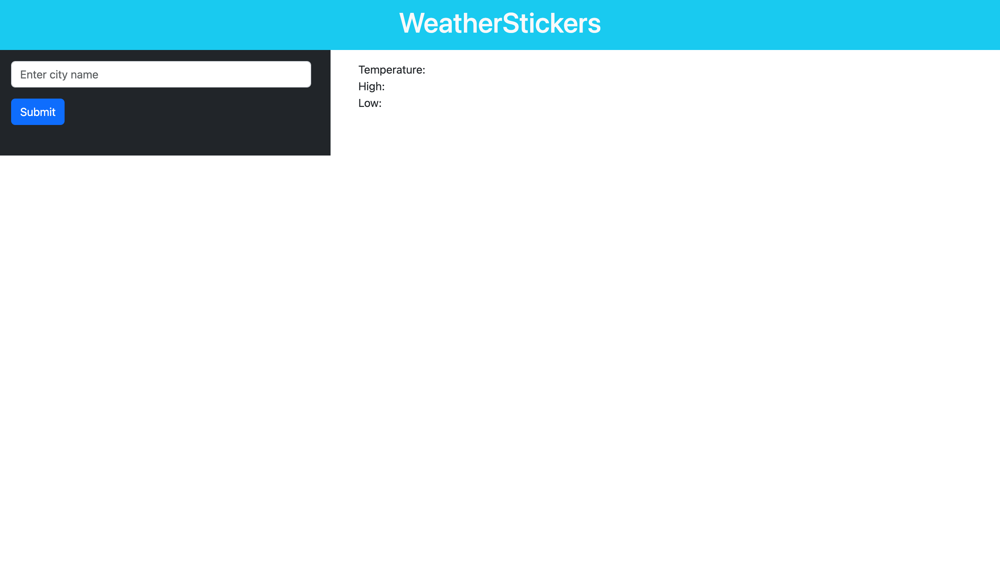

# WeatherStickers
***
## Description

WeatherStickers is a webpage housing a search engine designed to take third party api data from WeatherMap and Giphy. This was a project made with HTML, CSS, Bootstrap, and JavaScript using two API's and making them co-exist together.This was also a project for Vanderbuilt Bootcamp.

***

## The Two API's
* WeatherMaps - https://openweathermap.org/api a Weather API.
* Giphy - https://support.giphy.com/hc/en-us/articles/360034600411-GIPHY-API An API to acquire Gifs.

***
### User Story
-The user visits the page to find the weather.

-User enters a location for the weather.

-Upon submitting a location in the search bar, the user will recieve a giphy and a one worded response to the weather in that said location.

-User then has a great idea of the weather in that certain location with a gihpy related image that shows exactly what the weather is in that moment.

***
### Deployed Site & GitHub Repo

https://github.com/Facundog1/fy-project-repo 

http://127.0.0.1:5500/index.html

## Screenshot

MDNdocs:
